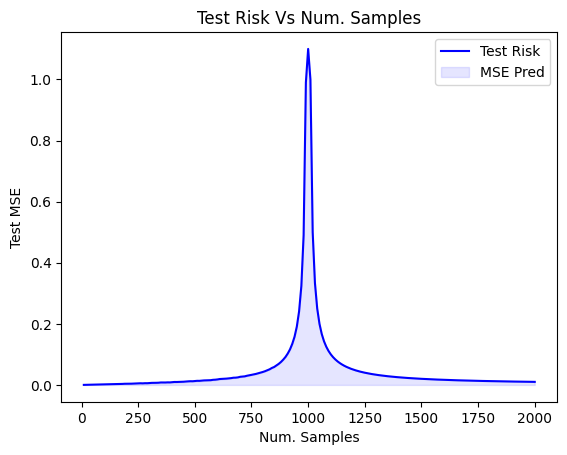

# STAD80: A Review of Preetum Nakkiran's "More Data Can Hurt for Linear Regression: Sample-wise Double Descent"

## Authors

- Shawn Santhoshgeorge
- Anaqi As Shafiq Bin Amir Razif

## Summary

In overparameterized linear regression, the phenomenon of double descent can be observed were the Test MSE initially decreases with a fixed parameter $d$ and an increasing sample $n$. It keeps on decreasing before increasing asymptotically towards infinity when $n \approx d$ before it begins decreasing again. We call the regime where $n<d$ to be the overparameterized regime and the underparameterized regime is when $n > d$. There are interesting concepts that can be found when researching and analyzing these regimes especially around the area of $n \approx d$.

This repository looks into the claims made in "More Data Can Hurt for Linear Regression: Sample-wise Double Descent" by Preetum Nakkiran. It includes the a deeper analysis on Section 3.1 of paper and works to explain the paper.

## Results

This graph was created based on a simple simulation based on the configuration stated in the paper.

 

## References

- [More Data Can Hurt for Linear Regression: Sample-wise Double Descent](https://arxiv.org/pdf/1912.07242.pdf)
